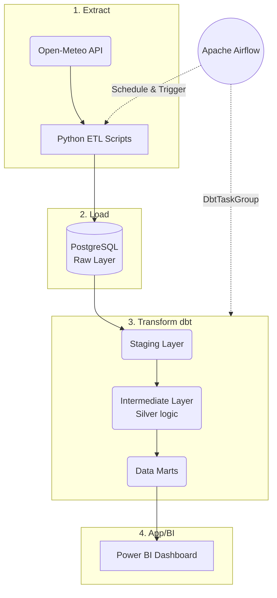
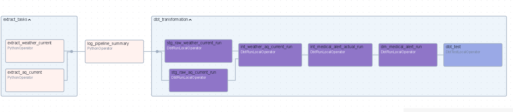
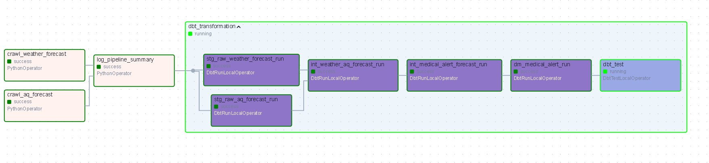
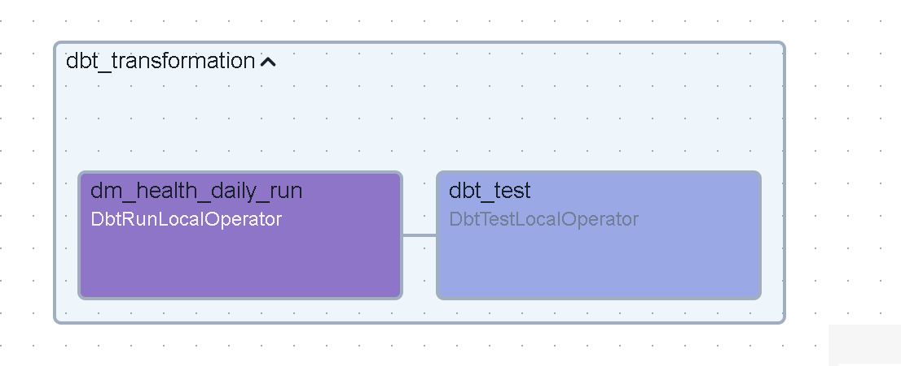
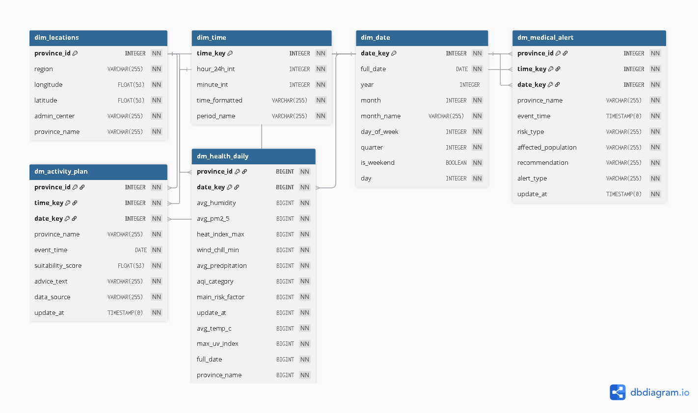

# Uber Healthy - Weather-Driven Health Analytics 🌦️🏥

Dự án **Uber Healthy** là một hệ thống dữ liệu ELT (Extract-Load-Transform) tiên tiến, được thiết kế để theo dõi, phân tích và đưa ra các khuyến nghị về sức khỏe tự động dựa trên dòng dữ liệu Thời tiết (Weather) và Chất lượng không khí (Air Quality) từ Open-Meteo API.

Mục tiêu chính của dự án là biến dữ liệu khí tượng thô thành những thông tin hữu ích (Actionable Insights) giúp bảo vệ sức khỏe cộng đồng và tối ưu hóa các hoạt động ngoài trời.

---

## 🌟 Tính năng cốt lõi (Core Features)

### 1. 🏥 Phân tích Sức khỏe hàng ngày (`dm_health_daily`)
*Đánh giá tổng hợp các chỉ số rủi ro môi trường theo ngày:*
- **Cảnh báo chất lượng không khí (AQI Monitoring)**: Phân loại chất lượng không khí (Good, Moderate, Unhealthy, Hazardous).
- **Cảnh báo thời tiết cực đoan (Extreme Conditions)**: Cảnh báo sớm về Nhiệt độ cực đoan (Extreme Heat/Cold), Mưa lớn, hoặc chỉ số UV cao (High UV).
- **Phân loại Rủi ro chính (Main Risk Factor)**: Xác định yếu tố rủi ro chính trong ngày để người dùng có biện pháp phòng ngừa.

### 2. 🏃 Kế hoạch Hoạt động Thông minh (`dm_activity_plan`)
*Sử dụng mô hình chấm điểm (Suitability Score) để tư vấn:*
- **Chấm điểm tính phù hợp (Score-based Advice)**: Tự động tính toán mức độ và điểm số phù hợp cho hoạt động ngoài trời (0-100).
- **Khuyến nghị cá nhân hóa (Personalized Recommendations)**: Đưa ra lời khuyên cụ thể theo từng mốc thời gian (Ví dụ: "Thời tiết tuyệt vời, thoải mái hoạt động!", "Nên hạn chế hoạt động mạnh", hoặc "Độc hại, không ra ngoài!").

### 3. 🚨 Cảnh báo Y tế kịp thời (`dm_medical_alert`)
*Hệ thống phát cảnh báo y tế linh hoạt cho cả Hiện tại (Actual) & Dự báo (Forecast):*
- **Đối tượng bị ảnh hưởng (Affected Population)**: Phân tích nhóm dân cư bị ảnh hưởng (Everyone, Sensitive Groups).
- **Khuyến nghị Y tế (Medical Recommendation)**: Đề xuất các hành động kịp thời như "Đeo khẩu trang N95", "Tránh ánh nắng trực tiếp", "Nguy cơ sốc nhiệt cao".

---

## 🏗️ Kiến trúc Công nghệ (Modern Data Stack)

Hệ thống được thiết kế theo tư tưởng hiện đại, đảm bảo tính ổn định và khả năng mở rộng nhanh chóng:

- **Orchestration**: [Apache Airflow](https://airflow.apache.org/) - Lên lịch và điều phối toàn bộ luồng Extract & Transformation.
- **Analytics Engineering**: [dbt (Data Build Tool)](https://www.getdbt.com/) - Tính toán, xây dựng mô hình dữ liệu (Marts) và kiểm soát chất lượng (Data Quality Tests).
- **Integration**: **Astronomer Cosmos** - Nhúng trực tiếp DBT Models thành các Airflow TaskGroups một cách mượt mà (`DbtTaskGroup`).
- **Data Warehouse**: [PostgreSQL](https://www.postgresql.org/) - Lưu trữ tập trung toàn bộ dữ liệu (Raw, Staging, Silver, Intermediate, Marts).
- **Data Source**: [Open-Meteo API](https://open-meteo.com/) - Nguồn dữ liệu thời tiết và chất lượng không khí mở.
- **Infrastructure**: Docker & Docker Compose - Quản lý môi trường độc lập, cô lập.
- **Data Visualization**: Power BI - Business Insights Dashboard.

---

## 🚀 Cấu trúc Luồng Dữ liệu (Pipelines)

Hệ thống cung cấp 3 DAGs (Directed Acyclic Graphs) chính xử lý dữ liệu với các Frequency khác nhau:

1. **`etl_current`**: Pipeline chạy mỗi 15 phút, thu thập dữ liệu thời tiết/AQI theo thời gian thực (Current).
2. **`etl_forecast`**: Pipeline chạy hàng ngày, dự báo thời tiết và AQI.
3. **`etl_historical`**: Pipeline tổng hợp dữ liệu quá khứ.

> **💡 Tính năng Backfill Nâng cao (Bypass Incremental)**  
> Toàn bộ các mô hình DBT (từ `staging` đến `marts`) đều được thiết kế dạng `incremental`. Đặc biệt, hệ thống hỗ trợ truyền tham số `is_backfill=True` qua Airflow Conf để **bỏ qua logic incremental** trong các trường hợp cần tải lại hoặc backfill trực tiếp lịch sử mà không lo bị chặn bởi giới hạn ngày của các bản ghi có sẵn.

---

## 🌊 Luồng Dữ liệu (Data Flow)

Dưới đây là sơ đồ luồng dữ liệu (Dataflow) bắt đầu từ nguồn API cho đến khi lên bảng Dashboard, và được điều phối bằng Airflow:


## Flowchart chi tiết về các luồn
### 1. Luồng hiện tại (Current Flow)

### 2. Luồng dự báo (Forecast Flow)

### 3. Luồng lịch sử (Historical Flow)

---

## ️ Mô hình Dữ liệu (Data Marts ERD)

Dưới đây là sơ đồ thực thể liên kết (Entity-Relationship Diagram) thể hiện cấu trúc của các Data Marts và các bảng Dimensions tương ứng trong hệ thống:



---

## 📂 Tổ chức mã nguồn (Project Structure)

```
Uber Healthy/
├── airflow/            # Orchestration Layer (Airflow)
│   ├── dags/           # DAGs: current_flow, forecast_flow, historical_flow
│   └── etl_app/        # Các scripts Python Extract & Load dữ liệu từ API
├── dbt/                # Transformation Layer (DBT)
│   ├── models/         
│   │   ├── staging/    # Làm sạch & chuyển đổi kiểu dữ liệu (stg_*)
│   │   ├── silver/     # Join bảng & xử lý logic tính toán y tế phức tạp (int_*)
│   │   ├── intermediate/ # Bảng trung gian chuẩn bị dữ liệu (int_*)
│   │   └── marts/      # Bảng nghiệp vụ đầu ra cho BI (dm_*)
│   └── tests/          # Data Quality Verification (Tests tùy chỉnh)
├── infra/              # Cấu hình kiến trúc hạ tầng (Docker Compose cho DB, Airflow)
└── README.md           # Project Documentation
```

---

## ⚙️ Hướng dẫn Cài đặt & Triển khai

### 1. Yêu cầu hệ thống
- Docker & Docker Compose.
- Python 3.9+ (nếu muốn phát triển local).

### 2. Triển khai Hệ thống
1. Clone repository:
   ```bash
   git clone <repo_url>
   cd "ELT Weather"
   ```
2. Thiết lập biến môi trường:
   Sao chép `.envexample` thành `.env` và cập nhật thông số kết nối Database.
3. Khởi chạy toàn bộ hệ thống qua Docker Compose:
   ```bash
   docker-compose up -d --build
   ```

### 3. Vận hành & Quản trị
- **Airflow UI**: Đăng nhập và theo dõi Pipelines tại `http://localhost:8080` (Mặc định User/Pass do bạn thiết lập).
- **dbt Documentation**: Xem data lineage và thư viện docs của mô hình:
  ```bash
  cd dbt
  dbt docs generate
  dbt docs serve
  dbt seed
  dbt run
  ```
---

## 📊 Business Insights Dashboard (Power BI)

Dự án có đi kèm Dashboard được thiết kế trên PowerBI để làm cầu nối giữa Data và Business (`uber_healthy.pbix`):
- **Bản đồ Rủi ro Sức khỏe**: Hiển thị biến động mức độ ô nhiễm theo từng tỉnh thành.
- **Biểu đồ Suitability**: Biến động điểm số hoạt động ngoài trời thời gian thực.
- **Thống kê Cảnh báo**: Trực quan hóa tỷ trọng rủi ro y tế và khuyến nghị được đưa ra.

---

## 📝 Liên hệ

Dự án được thực hiện bởi **Trần Văn An**.  
Mọi thắc mắc hoặc góp ý vui lòng liên hệ qua email: `antran.261004@gmail.com`.
