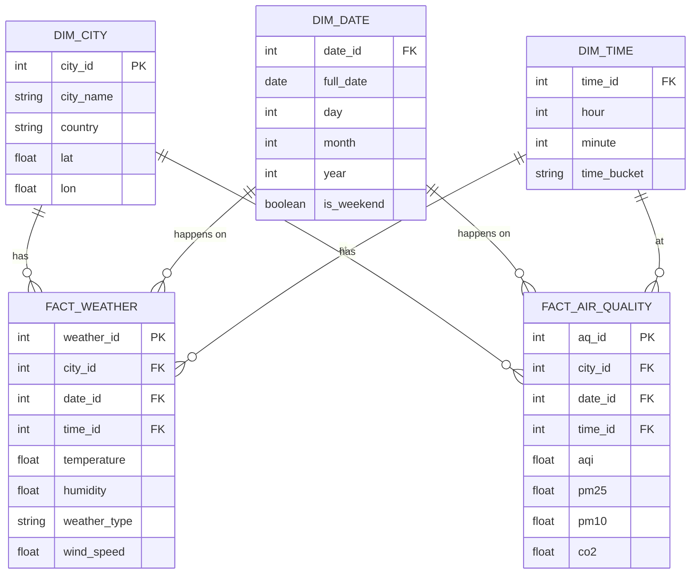

# ELT Weather Project

Dự án Data Engineering xây dựng quy trình ELT (Extract-Load-Transform) để thu thập, xử lý và phân tích dữ liệu Thời tiết (Weather) và Chất lượng không khí (Air Quality) cho các thành phố tại Việt Nam.

Hệ thống được thiết kế để chạy hoàn toàn trên Docker, sử dụng các công nghệ phổ biến trong ngành dữ liệu.

## � Mục tiêu Phân tích & Business Insights

Dự án này được thiết kế để trả lời các câu hỏi nghiệp vụ (Business Questions) cụ thể về tác động của thời tiết đến môi trường sống:

### 1. 🌦️ Phân tích Thời tiết (Weather Analysis)
*Tập trung vào biến động khí hậu tại các thành phố.*
- **Thống kê cơ bản**: Tính toán nhiệt độ, độ ẩm, tốc độ gió trung bình theo (Ngày / Tuần / Tháng).
- **Cực trị**: Xác định thành phố có nhiệt độ cao nhất/thấp nhất trong khoảng thời gian.
- **Xu hướng (Trend)**: Biểu đồ biến động nhiệt độ & độ ẩm theo thời gian.
- **Tương quan nội tại**: Phân tích mối quan hệ giữa nhiệt độ và độ ẩm (Correlation).

### 2. 🌫️ Phân tích Chất lượng không khí (Air Quality Analysis)
*Đánh giá mức độ ô nhiễm và an toàn sức khỏe.*
- **Xếp hạng**: Thành phố nào có không khí sạch nhất và ô nhiễm nhất (dựa trên AQI trung bình)?
- **Chu kỳ**: Xu hướng thay đổi AQI theo khung giờ trong ngày (Sáng/Chiều/Tối) và theo mùa.
- **Cảnh báo**: Phân tích điều kiện thời tiết (Nhiệt/Ẩm) khi AQI vượt ngưỡng nguy hại (>150).
- **Tần suất**: Đếm số lượng ngày "Ô nhiễm cao" trong tháng.

### 3. 📉 Tương quan Thời tiết & Không khí (Correlation)
*Tìm hiểu nguyên nhân và tác động.*
- **Nhiệt độ vs AQI**: Khi trời nóng lên, chất lượng không khí có xu hướng xấu đi không?
- **Độ ẩm vs AQI**: Độ ẩm cao có giúp giảm bụi mịn không?
- **Độ nhạy (Sensitivity)**: Thành phố nào chịu ảnh hưởng mạnh nhất của thời tiết lên chất lượng không khí?

---

## �🏗 Kiến trúc & Công nghệ

Dự án sử dụng các công nghệ sau:

- **Orchestration**: [Apache Airflow](https://airflow.apache.org/) - Lên lịch và quản lý workflow (DAGs).
- **Data Processing**: [Apache Spark](https://spark.apache.org/) (PySpark) - Xử lý dữ liệu phân tán, clean và transform dữ liệu.
- **Data Warehouse**: [PostgreSQL](https://www.postgresql.org/) - Lưu trữ dữ liệu đã qua xử lý (Warehouse).
- **Infrastructure**: Docker & Docker Compose - Quản lý môi trường và service.
- **Storage**: S3 (AWS S3) - Data Lake (Raw data).

### 📐 Luồng hoạt động (Workflow Architecture)

Dưới đây là sơ đồ luồng dữ liệu của hệ thống ELT:

```mermaid
graph TD
    subgraph Sources ["Nguồn dữ liệu"]
        API_W["Weather API"]
        API_AQ["Air Quality API"]
    end

    subgraph DataLake ["Data Lake (MinIO/S3)"]
        Raw["Raw Data (JSON)"]
    end

    subgraph Processing ["Apache Spark Processing"]
        Transform["Transform & Clean"]
    end

    subgraph Warehouse ["Data Warehouse (PostgreSQL)"]
        DW[("Star Schema DB")]
    end

    API_W -->|Extract (Airflow)| Raw
    API_AQ -->|Extract (Airflow)| Raw
    Raw -->|Read| Transform
    Transform -->|Load / Merge| DW
```

## 🗄️ Mô hình dữ liệu (Data Warehouse Schema)

Hệ thống Data Warehouse được thiết kế theo mô hình **Star Schema** để tối ưu cho việc truy vấn và báo cáo:



## 📂 Cấu trúc dự án

```
ELT Weather/
├── api/                # FastAPI Service (Weather & AQ Data)
├── airflow/
│   ├── dags/               # Chứa các Airflow DAGs (etl_day, etl_year)
│   ├── elt_app/            # Source code chính của ứng dụng
│   │   ├── scripts/        # Python scripts cho các bước (extract, transform, load)
│   │   ├── sql/            # Các câu lệnh SQL (Merge, DDL)
│   │   └── utils/          # Các hàm tiện ích (Config, Logging...)
│   ├── Dockerfile.airflow  # Custom image cho Airflow
│   └── requirements.txt    # Thư viện Python cho Airflow
├── spark/
│   ├── conf/               # Cấu hình Spark (spark-defaults.conf)
│   ├── jars/               # Các thư viện Java/Scala cần thiết (JDBC, AWS...)
│   └── Dockerfile.spark    # Custom image cho Spark
├── postgres-init/          # Script khởi tạo database PostgreSQL
├── docker-compose.yml      # File cấu hình toàn bộ stack
└── README.md               # Tài liệu dự án
```

## 🚀 Cài đặt và Chạy dự án

### Tiền đề (Prerequisites)
- [Docker](https://www.docker.com/) và [Docker Compose](https://docs.docker.com/compose/) đã được cài đặt trên máy.
- Git.

### Các bước triển khai

1. **Clone repository:**
   ```bash
   git clone <repo_url>
   cd "ELT Weather"
   ```

2. **Cấu hình biến môi trường:**
   Copy file `.envexample` thành `.env` và cập nhật các thông tin cần thiết:
   ```env
   # AWS / S3 Config
   AWS_ACCESS_KEY_ID=minioadmin
   AWS_SECRET_ACCESS_KEY=minioadmin
   AWS_DEFAULT_REGION=us-east-1
   BUCKET=weather-data

   # Cấu hình Airflow & Database
   AIRFLOW_UID=50000
   POSTGRES_USER=airflow
   POSTGRES_PASSWORD=airflow
   POSTGRES_DB=weather_dw
   ```

3. **Tải các thư viện phụ thuộc (JARs)**
   Dự án sử dụng Spark với các thư viện mở rộng để kết nối S3, PostgreSQL và Delta Lake. Các thư viện này không được lưu trong git để giảm dung lượng.
   Chạy script sau để tự động tải về:
   ```bash
   bash setup.sh
   ```
   *Script này sẽ tải các file .jar cần thiết vào thư mục `spark/jars/`.*

4. **Khởi chạy hệ thống với Docker Compose:**
   ```bash
   docker compose up -d --build
   ```
   Lệnh này sẽ build các images (Airflow, Spark) và khởi động các containers:
   - `postgres`: Database cho Airflow metadata và Data Warehouse.
   - `airflow-webserver`: Giao diện quản lý Airflow.
   - `airflow-scheduler`: Bộ lập lịch của Airflow.
   - `spark-master` & `spark-worker`: Cluster Spark.

5. **Truy cập giao diện quản trị:**
   - **Airflow UI**: http://localhost:8080 (Tài khoản mặc định: `admin`/`admin` - xem trong `docker-compose.yml` phần `airflow-init`).
   - **Spark Master UI**: http://localhost:8081.

6. **Cấu hình Connections (Airflow UI):**
   Vào Airflow UI -> **Admin** -> **Connections** để thiết lập các kết nối:

   **a. Kết nối PostgreSQL (Data Warehouse):**
   *Kết nối này đã được tự động cấu hình qua biến môi trường trong `docker-compose.yml`.*
   - **Conn Id**: `postgres_default`
   - **Conn Type**: `Postgres`
   - **Host**: `postgres-db`
   - **Schema**: `weather_dw`
   - **Login**: `airflow`
   - **Password**: `airflow`
   - **Port**: `5432`

   **b. Kết nối Spark:**
   - **Conn Id**: `spark_default`
   - **Conn Type**: `Generic`
   - **Host**: `spark://spark-master`
   - **Port**: `7077`
   - **Extra**: `{
      "deploy-mode": "client",
      "spark-binary": "spark-submit"
   }`

## 🏃‍♂️ Sử dụng Pipeline

Dự án bao gồm các DAGs chính trong Airflow:

1. **`etl_daily`**: Chạy hàng ngày để lấy dữ liệu thời tiết và AQI hiện tại.
2. **`etl_yearly`**: (Tùy chọn) Chạy định kỳ để lấy dữ liệu lịch sử hoặc tổng hợp theo năm.

### Luồng xử lý dữ liệu (Workflow):

1. **Extract**: Gọi API thời tiết/AQI, lưu dữ liệu thô (JSON) vào S3 (Data Lake).
2. **Transform**: Spark đọc dữ liệu từ S3, làm sạch, chuyển đổi cấu trúc và lưu lại dưới dạng Parquet.
3. **Load**: Load dữ liệu từ Parquet vào PostgreSQL (Data Warehouse) sử dụng cơ chế Merge (Upsert) để tránh trùng lặp.

## 📊 Kết nối với Power BI

File báo cáo `weather.pbix` đã được chuẩn bị sẵn để trực quan hóa dữ liệu từ Data Warehouse. Để xem báo cáo, bạn cần kết nối Power BI với PostgreSQL local.

### Thông tin kết nối (Credentials):
- **Server:** `localhost`
- **Port:** `5432`
- **Database:** `weather_dw`
- **Username:** `airflow`
- **Password:** `airflow`

### Hướng dẫn cập nhật nguồn dữ liệu:
1. Mở file `weather.pbix` bằng Power BI Desktop.
2. Nếu Power BI yêu cầu cài đặt thêm Driver (Npgsql), hãy tải và cài đặt [Npgsql](https://github.com/npgsql/npgsql/releases) (chọn bản MSI để cài đặt dễ dàng).
3. Trên thanh công cụ, chọn **File** > **Options and settings** > **Data source settings**.
4. Chọn nguồn dữ liệu PostgreSQL hiện tại và chọn **Change Source...** (hoặc **Edit Permissions** để sửa user/pass).
5. Đảm bảo thông tin là `localhost:5432` và `weather_dw`.
6. Nếu được hỏi Credentials, chọn tab **Database**, nhập Username/Password là `airflow`/`airflow`.
7. Nhấn **Refresh** để tải dữ liệu mới nhất.

## 🔌 API Service (FastAPI)

Dự án cung cấp một RESTful API (FastAPI) để truy xuất dữ liệu từ Data Warehouse.

### Điểm cuối (Endpoints):
- **Documented UI (Swagger):** http://localhost:8000/docs
- **ReDoc:** http://localhost:8000/redoc

### Các API chính:
- `GET /weather/{city_id}?from_date=YYYY-MM-DD&to_date=YYYY-MM-DD`: Lấy dữ liệu thời tiết theo khoảng thời gian.
- `GET /air_quality/{city_id}?from_date=YYYY-MM-DD&to_date=YYYY-MM-DD`: Lấy dữ liệu AQI theo khoảng thời gian.
- `GET /city`: Lấy danh sách thành phố.
- `GET /city/{id}`: Lấy thông tin thành phố theo ID.

### Cách chạy:
API service được tích hợp trong Docker Compose. Khi chạy `docker compose up`, service `api` sẽ tự động khởi động tại port `8000`.

## 🛠 Phát triển (Development)

Để chạy thử nghiệm các script Python cục bộ (không qua Docker), bạn cần thiết lập môi trường ảo:

```bash
# Tạo môi trường ảo
python -m venv .venv
source .venv/bin/activate  # Hoặc config .venv\Scripts\activate trên Windows

# Cài đặt thư viện
pip install -r airflow/requirements.txt
```

### Chạy thủ công (Ví dụ)
Nếu muốn chạy một file script cụ thể:
```bash
python airflow/elt_app/scripts/extract/weather.py
```
*Lưu ý: Cần đảm bảo các biến môi trường được set đúng trong phiên làm việc local.*

## 📝 Liên hệ

Dự án được thực hiện bởi Trần Văn An. Mọi thắc mắc vui lòng liên hệ qua antran.261004@gmail.com hoặc tạo Issue trên repo này.
